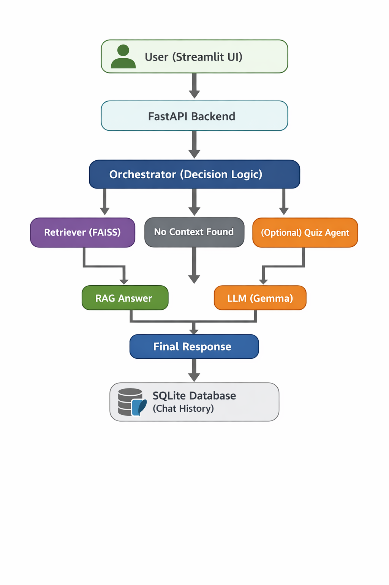

# 🎓 AI-Powered Learning Assistant (RAG + LLM)

An intelligent AI tutor that uses **Retrieval-Augmented Generation (RAG)** to answer questions from PDF documents and falls back to **Gemma (via Ollama)** when no relevant context is found.

---

## 🎥 Demo

👉 https://youtu.be/s3-mYSU4IRw

---

## 📌 Overview

This project solves a key limitation of Large Language Models (LLMs): **lack of domain-specific knowledge and hallucination**.

The system enhances accuracy by:
- Retrieving relevant information from uploaded PDFs (RAG)
- Using LLM fallback when no context is available

This creates a hybrid AI system that is both context-aware and general-purpose.

---

## ✨ Features

- 📄 PDF-based question answering using FAISS (RAG)
- 🤖 LLM fallback using Gemma (Ollama)
- ⚡ FastAPI backend for scalable APIs
- 🎨 Streamlit UI for interactive chat
- 🧠 Semantic search with embeddings
- 🗂️ SQLite database for chat history
- 🔄 Async PDF ingestion (no Celery required)

---

## 🏗️ Architecture




---

## 🧠 How It Works

1. User asks a question from the UI  
2. Query is converted into embeddings  
3. FAISS retrieves relevant document chunks  
4. System checks if context is relevant  
5. If relevant → RAG answer  
6. If not → LLM fallback (Gemma)  
7. Response is returned and stored in database  

---

## 🛠️ Tech Stack

- **Backend:** FastAPI  
- **Frontend:** Streamlit  
- **LLM:** Gemma:2b (Ollama)  
- **Vector DB:** FAISS  
- **Embeddings:** Sentence Transformers  
- **Database:** SQLite  
- **Language:** Python  

---

## ⚙️ Installation

```bash
git clone https://github.com/Harisharivananthan/AI_Personalized_Learning_Assistant
cd Personalized Learning Assistant

python -m venv env
source env/Scripts/activate

pip install -r requirements.txt

▶️ Usage

# Run LLM
ollama run gemma:2b

# Run backend
uvicorn app.main:app --reload

# Run frontend
streamlit run frontend/app.py

Project Structure
/Personalized Learning Assistant
│── app/
│   ├── api/routes/
│   ├── agents/
│   ├── rag/
│   ├── services/
│   ├── db/
│   └── core/
│
│── frontend/app.py
│── data/pdfs/
│── uploads/
│── app.db
│── requirements.txt
│── README.md

🚀 Future Improvements
Add authentication system
Improve retrieval with similarity scoring
Add source citations in responses
Enhance UI/UX
Deploy to cloud


👨‍💻 Author

Harish A
🔗 https://github.com/Harisharivananthan